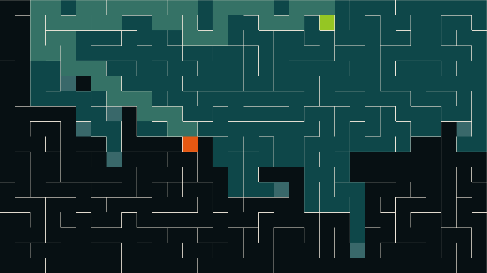

# Maze

Small project to visualize maze generation and solving.



Implemented generation algorithms:

  - Depth first search
  - Randomized Kruskal
  - Randomized Prim
  - Eller
  - Hunt and Kill

Implemented solving algorithms:

  - Depth first search
  - Breadth first search
  - Dijkstra
  - Greedy
  - A*

## How to run

```
cargo run --release -- --help
cargo run --release
```

## Known problems

  - Kruskal's algorithm is very slow on large mazes, specially near the end
  - Kruskal's algorithm doesn't work properly with odd cell-sizes
  - Kruskal's algorithm doesn't generate the same maze when provided with the same seed
